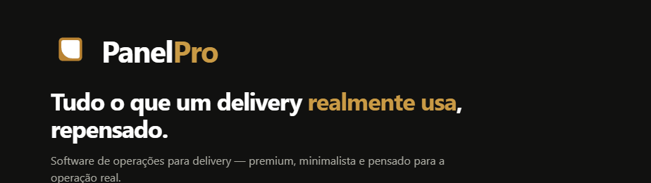

<!--
  ┌────────────────────────────────────────────────────────────────┐
  │  README de perfil do GitHub · Panel Pro                          │
  │                                                                  │
  │  COMO USAR:                                                      │
  │  1. Crie um repositório com o MESMO nome do seu usuário          │
  │     (ex.: github.com/seu-usuario/seu-usuario).                   │
  │  2. Coloque este README.md na raiz dele.                         │
  │  3. Copie também a pasta  assets/  (banner + logos) para a raiz. │
  │  4. Substitua os campos marcados com  «...»  pelos seus dados.   │
  └────────────────────────────────────────────────────────────────┘
-->

  

    

  <!-- Logo com troca automática claro/escuro -->
  <picture>
    <source media="(prefers-color-scheme: dark)" srcset="assets/logo-mark-panel.png" width="72" />
    
  </picture>

  <h1>Olá, eu sou Rafael Santos</h1>

  
<b>Desenvolvedor(a) e criador(a) da Panel Pro</b> — software de operações para quem vive de delivery.

  
  
  

 

## Sobre mim

Gosto de transformar operação bagunçada em software claro e rápido. Hoje meu foco é construir a **Panel Pro** — repensando as ferramentas que um delivery usa de verdade, todo dia. Fora do código, «algo seu aqui».

|  |  |
| :-- | :-- |
| **Construindo** | Panel Pro |
| **Função** | Full-stack & Produto |
| **Base** | Brasil |
| **Foco** | Delivery & operações |

 

---

  O PROJETO EM DESTAQUE
  <h2>Panel Pro</h2>
  
<i>“Tudo o que um delivery realmente usa, repensado.”</i>

A **Panel Pro** é uma plataforma brasileira de operações para delivery. A ideia é direta: reunir as funcionalidades que um delivery *realmente usa* no dia a dia — repensadas para serem o mais práticas e otimizadas possível — e tornar um software de qualidade acessível a qualquer empresa, não só às grandes redes.

### O que o painel faz

| Módulo | O que resolve |
| :-- | :-- |
| **Pedidos** | Entrada de pedidos em tempo real, do balcão ao delivery, em um fluxo só. |
| **Cozinha** | A cozinha enxerga o que preparar e em que ordem — sem papel, sem correria. |
| **Entregas** | Despache entregadores e acompanhe cada rota até a porta do cliente. |
| **Cardápio** | Gestão de cardápio, preços e disponibilidade em segundos. |

 

> ### A promessa
> **Tudo o que um delivery realmente usa, repensado.**
> Gerencie pedidos, cozinha e entregadores em um só painel — rápido, claro e pensado para a operação real.
>
> **Rápido** · ações em um toque, sem telas de espera &nbsp;•&nbsp; **Claro** · status por cor, nada de ruído &nbsp;•&nbsp; **Operação real** · feito para o balcão cheio, não para o slide.

 

### Uma amostra do painel · valores ilustrativos

| Pedidos hoje | Ticket médio | Tempo médio |
| :--: | :--: | :--: |
| **128** ▲ 12% | **R$ 62,40** ▲ 4% | **28 min** |

 

---

  <picture>
    <source media="(prefers-color-scheme: dark)" srcset="assets/logo-mark-panel.png" width="28" />
    
  </picture>
   
  Perfil construído com o design system da <b>Panel&nbsp;Pro</b>.

