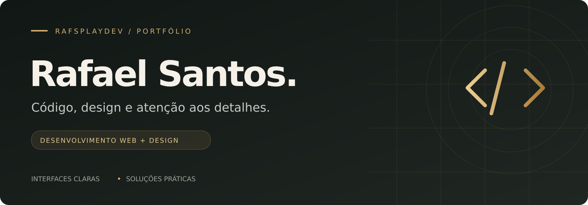
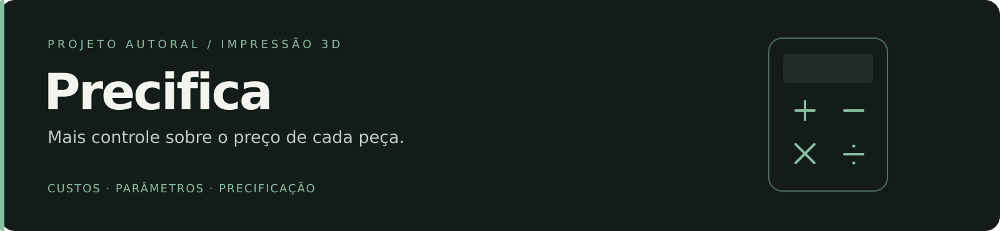

  

**Desenvolvedor web em formação · Designer · Criador de produtos digitais**

Transformo problemas do cotidiano em ferramentas práticas, 
com atenção à experiência de uso e aos detalhes visuais.

[Conheça o Precifica](https://precifica.dropcolor.com.br/tutorial) · [Vamos conversar](mailto:rafsplayofc@gmail.com)

 

## Um pouco sobre mim

Sou Rafael Santos, estudante de **Técnico em Desenvolvimento de Sistemas no Senac**, com formação complementar em design gráfico e identidade visual. Construo projetos próprios para colocar o aprendizado em prática e desenvolver soluções que sejam úteis de verdade.

Gosto de trabalhar na conexão entre **interface, lógica e experiência de uso**: organizar informações, simplificar tarefas e cuidar da hierarquia visual, da consistência e do acabamento de cada tela.

Estou buscando minha **primeira oportunidade em desenvolvimento**, especialmente em front-end ou em um estágio com espaço para aprender e contribuir.

 

## O que levo para os projetos

| Interface & design | Desenvolvimento & produto |
| :--- | :--- |
| Atenção à hierarquia visual, aos espaçamentos e à legibilidade. | Construção de interfaces com JavaScript, React e Next.js. |
| Formação em design gráfico e identidade visual. | Integração de APIs e persistência de dados. |
| Cuidado com consistência e clareza nos fluxos de uso. | Transformação de necessidades do cotidiano em funcionalidades. |
| Interesse em tornar tarefas complexas mais intuitivas. | Aprendizado prático, evolução contínua e atenção aos detalhes. |

 

## Ferramentas que uso

**Interfaces** &nbsp; JavaScript · React · Next.js · HTML · CSS  
**Integrações e dados** &nbsp; APIs · PostgreSQL · Supabase · Mercado Pago  
**Versionamento** &nbsp; Git — conhecimentos básicos

Meu aprendizado acontece principalmente construindo: conectando telas, regras de negócio, dados e integrações em projetos próprios.

 

## Projeto em destaque

 

O **Precifica** é uma calculadora intuitiva de preços para peças impressas em 3D. Desenvolvi a ferramenta para reunir os parâmetros que influenciam uma cobrança e oferecer mais controle sobre a formação do preço.

### O que a ferramenta considera

- **Materiais:** cadastro de filamentos e parâmetros de consumo.
- **Operação:** consumo e tarifa de energia, além da depreciação da impressora.
- **Preço de venda:** markup e taxas de marketplaces.
- **Uso do serviço:** integração com a **API do Mercado Pago** para cobrar a assinatura.

### Meu papel

Atuo na construção do produto, no desenvolvimento da interface, na organização dos campos e das regras de cálculo e na integração da cobrança de assinaturas. O projeto reúne duas coisas que valorizo: **clareza visual e utilidade prática**.

**As taxas dos marketplaces entram no cálculo do preço da peça; o Mercado Pago é usado para cobrar a assinatura do serviço.**

→ **[Ver o tutorial e conhecer o Precifica](https://precifica.dropcolor.com.br/tutorial)**

 

## Também construí o PanelPro

O **[PanelPro](https://panelpro.app.br)** reúne cardápio digital e recursos de gestão para restaurantes, como cadastro de produtos, estatísticas de vendas e cálculo de entregas. O sistema está em uso real em uma pizzaria.

Atuo no desenvolvimento e na evolução do produto, cuidando da interface, da organização dos fluxos e das funcionalidades. Essa experiência me ajuda a conectar **design e programação às necessidades de quem usa o sistema no dia a dia**.

 

---

**Uma boa interface começa entendendo quem vai usá-la.**

Rafael Santos · Desenvolvimento web & design

